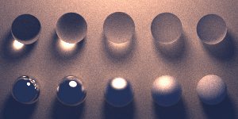
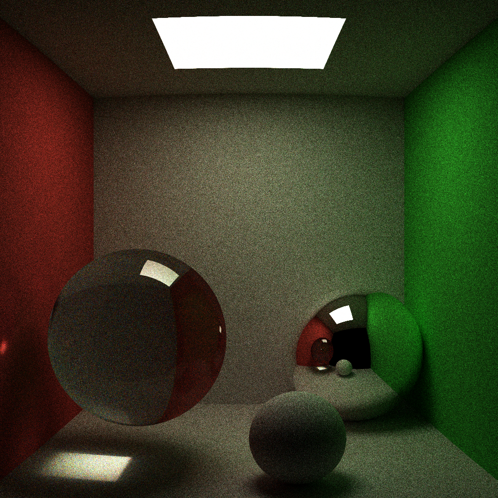
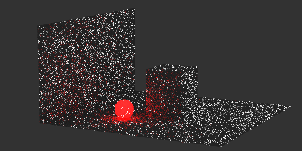
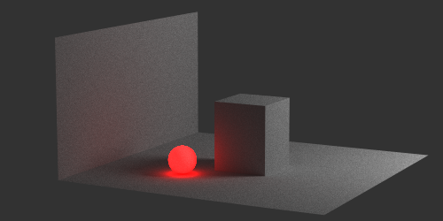

This is a ray tracer written in C# that I wrote ages ago. It supports:

- **Global illumination** it simulates the way that light bounces off of objects and illuminates others
- **Progressive refinement** it quickly generates a full grainy image and slowly adds more samples, converging on the solution over time
- **Render pause/resume** the render can be paused and resumed later - all data is stored on disk
- **Area lights** actually, any object can emit light
- **Primitives** triangles and spheres
- **Reflection** and **refraction** and **glossiness** for both

**Cornell box**

**Shortly after beginning a render**

**Hours later**

